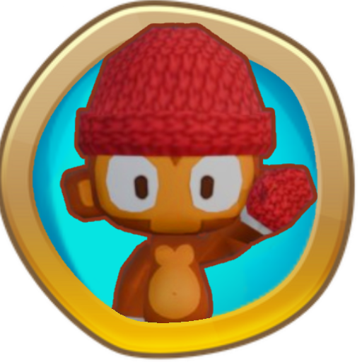

<h1 align="center">

HeliumHelper
</h1>

Adds Wendell, a hero that has befriended the bloons.

Wendell starts at being able to befriend green bloons and under. You can spawn these bloons and they will orbit Wendell. As Wendell levels up, he can befriend these bloons faster, and can eventually befriend up to a BAD.

<b>Made for the 1330 Mod Jam with the theme "Unity"</b>

